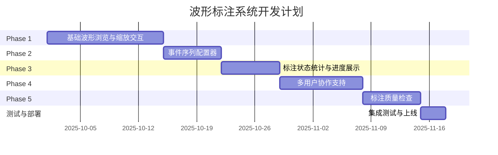

# 波形标注系统 - 实施路线图

**版本**: v1.0
**项目周期**: 6.5周 (含测试与部署)
**团队规模**: 2-3人 (全栈开发)

---

## 📅 总览时间线



**关键里程碑**:
- ✅ **Week 2结束**: 可浏览和缩放波形
- ✅ **Week 3结束**: 可配置事件序列
- ✅ **Week 4结束**: 可标注并查看进度
- ✅ **Week 6结束**: 多用户协作就绪
- ✅ **Week 7结束**: 生产环境部署

---

## Phase 1: 基础波形浏览与缩放交互 (2周)

**目标**: 实现核心波形查看器，支持文件/Trial导航和高性能缩放

### Week 1: 基础架构搭建

#### Day 1-2: 项目初始化
**前端**:
- [x] 创建Vite + React + TypeScript项目
- [x] 配置Tailwind CSS + shadcn/ui
- [x] 设置ESLint + Prettier代码规范
- [x] 配置路由 (React Router v6)
- [x] 搭建基础布局 (三栏式)

**后端**:
- [x] 创建FastAPI项目结构
- [x] 配置MongoDB连接 (Motor)
- [x] 设置环境变量管理 (pydantic-settings)
- [x] 编写Dockerfile和docker-compose.yml

**验收标准**:
- 前端可运行 `npm run dev` 启动开发服务器
- 后端可访问 `http://localhost:8000/docs` 查看API文档
- Docker Compose可一键启动MongoDB

---

#### Day 3-4: H5文件扫描与元数据提取
**任务**:
```python
# backend/app/services/h5_service.py
class H5Service:
    def scan_files(self) -> List[Dict]:
        """扫描dataset目录下所有H5文件"""
        pass

    def load_trial_count(self, file_path: str) -> int:
        """获取H5文件中Trial数量"""
        pass

    def load_trial_metadata(self, file_path: str, trial_index: int):
        """提取Trial元数据 (时长、采样率、数据点数)"""
        pass
```

**API端点**:
```http
GET /api/files
Response: [{fileId, trialCount, createdAt}]
```

**验收标准**:
- 后端可正确扫描 `dataset/` 目录
- API返回所有H5文件列表
- 前端文件列表组件显示文件树

---

#### Day 5-6: 缩略图生成与缓存
**任务**:
```python
def generate_thumbnail(self, data: np.ndarray, target_points: int = 100):
    """降采样生成缩略图"""
    downsample_factor = len(data) // target_points
    return data[::downsample_factor].tolist()
```

**API端点**:
```http
GET /api/files/{file_id}/trials
Response: [{trialIndex, thumbnail: {timestamps, values}, duration}]
```

**数据库**:
```javascript
// MongoDB - trial_metadata集合
{
  fileId: "dataset/exp01/data.h5",
  trialIndex: 0,
  thumbnail: {timestamps: [...], values: [...]},
  statistics: {duration: 10.5, sampleRate: 1000}
}
```

**验收标准**:
- 点击文件后，Trial列表显示所有Trial及其缩略图
- 缩略图渲染流畅 (<100ms)
- 缩略图数据已缓存到MongoDB

---

### Week 2: 波形渲染与交互

#### Day 7-8: uPlot波形图集成
**前端任务**:
```typescript
// components/WaveformViewer/WaveformChart.tsx
import uPlot from 'uplot';
import 'uplot/dist/uPlot.min.css';

interface WaveformChartProps {
  raw: {timestamps: number[], values: number[]};
  filtered: {timestamps: number[], values: number[]};
}

const WaveformChart: React.FC<WaveformChartProps> = ({raw, filtered}) => {
  const chartRef = useRef<HTMLDivElement>(null);
  const uPlotInstance = useRef<uPlot | null>(null);

  useEffect(() => {
    // 初始化uPlot实例
    const opts: uPlot.Options = {
      width: chartRef.current!.clientWidth,
      height: 600,
      series: [
        {},
        {stroke: "rgba(156,163,175,0.3)", label: "Raw"},
        {stroke: "#3B82F6", width: 2, label: "Filtered"}
      ]
    };

    uPlotInstance.current = new uPlot(
      opts,
      [raw.timestamps, raw.values, filtered.values],
      chartRef.current!
    );

    return () => uPlotInstance.current?.destroy();
  }, [raw, filtered]);

  return <div ref={chartRef} className="w-full h-[600px]" />;
};
```

**后端任务**:
```python
# 完整波形预处理
@router.get("/files/{file_id}/trials/{trial_id}/waveform")
async def get_waveform(file_id: str, trial_id: int):
    data = h5_service.preprocess_waveform(file_id, trial_id)
    return {
        "raw": data["raw"],
        "filtered": data["filtered"],
        "keypoints": data["keypoints"]
    }
```

**验收标准**:
- 点击Trial后，工作区显示完整波形
- 原始波形(灰色)和滤波波形(蓝色)叠加显示
- 10万采样点渲染时间 <500ms

---

#### Day 9-10: 缩放交互实现
**前端任务**:
```typescript
// hooks/useZoomControl.ts
const useZoomControl = (uPlotInstance: uPlot | null) => {
  const handleWheel = useCallback((e: WheelEvent) => {
    e.preventDefault();
    const delta = e.deltaY;
    const zoomFactor = delta > 0 ? 0.9 : 1.1;

    if (e.shiftKey) {
      // 仅Y轴缩放
      scaleYAxis(uPlotInstance, zoomFactor);
    } else if (e.ctrlKey || e.metaKey) {
      // 仅X轴缩放
      scaleXAxis(uPlotInstance, zoomFactor);
    } else {
      // 全方向缩放
      scaleAxes(uPlotInstance, zoomFactor);
    }
  }, [uPlotInstance]);

  useEffect(() => {
    const container = uPlotInstance?.root;
    container?.addEventListener('wheel', handleWheel, {passive: false});
    return () => container?.removeEventListener('wheel', handleWheel);
  }, [handleWheel]);
};
```

**缩放历史管理**:
```typescript
// stores/workspaceStore.ts
interface ZoomState {
  xMin: number; xMax: number;
  yMin: number; yMax: number;
}

interface WorkspaceStore {
  zoomHistory: ZoomState[];
  currentZoomIndex: number;

  pushZoomState: (state: ZoomState) => void;
  undoZoom: () => ZoomState | null;
  redoZoom: () => ZoomState | null;
}
```

**验收标准**:
- 滚轮缩放流畅无卡顿 (60fps)
- Shift/Cmd定向缩放正常工作
- Ctrl+Z/Ctrl+Shift+Z可回退/前进视图
- 左上角面包屑显示缩放层级

---

#### Day 11-12: 横向刻度条与导航
**前端任务**:
```typescript
// components/WaveformViewer/TimelineRuler.tsx
const TimelineRuler: React.FC = ({timestamps, onSeek}) => {
  const canvasRef = useRef<HTMLCanvasElement>(null);

  useEffect(() => {
    const ctx = canvasRef.current?.getContext('2d');
    if (!ctx) return;

    // 绘制刻度线
    const step = (timestamps[timestamps.length-1] - timestamps[0]) / 10;
    for (let t = timestamps[0]; t <= timestamps[timestamps.length-1]; t += step) {
      const x = (t - timestamps[0]) / (timestamps[timestamps.length-1] - timestamps[0]) * ctx.canvas.width;
      ctx.strokeStyle = '#999';
      ctx.beginPath();
      ctx.moveTo(x, 0);
      ctx.lineTo(x, 20);
      ctx.stroke();

      // 绘制时间标签
      ctx.fillText(`${t.toFixed(1)}s`, x, 35);
    }
  }, [timestamps]);

  const handleClick = (e: React.MouseEvent) => {
    const rect = canvasRef.current!.getBoundingClientRect();
    const x = e.clientX - rect.left;
    const timeRatio = x / rect.width;
    const timestamp = timestamps[0] + timeRatio * (timestamps[timestamps.length-1] - timestamps[0]);
    onSeek(timestamp);
  };

  return <canvas ref={canvasRef} onClick={handleClick} className="w-full h-10" />;
};
```

**验收标准**:
- 刻度条显示在波形图上方
- 点击刻度条可跳转到对应时间
- 刻度标签清晰可读

---

#### Day 13-14: Phase 1测试与优化
**测试清单**:
- [ ] 加载100个H5文件性能测试
- [ ] 缩放交互流畅度测试 (帧率监控)
- [ ] 内存泄漏测试 (切换Trial后内存是否释放)
- [ ] 跨浏览器兼容性测试 (Chrome/Firefox/Safari)

**优化项**:
- [ ] 添加Skeleton加载动画
- [ ] 实现Trial列表虚拟滚动 (react-window)
- [ ] 优化uPlot渲染 (OffscreenCanvas)

---

## Phase 2: 事件序列配置器 (1周)

**目标**: 实现拖拽式事件序列配置，支持全局模板和私有模板

### Day 15-16: 数据模型与API

**MongoDB Schema**:
```javascript
// event_templates集合
{
  _id: ObjectId,
  name: "标准接触实验",
  isGlobal: true,
  createdBy: ObjectId("admin_user_id"),
  phases: [
    {id: "baseline", name: "Baseline", color: "#3B82F6", shortcut: "1", order: 0},
    {id: "approach", name: "Approach", color: "#10B981", shortcut: "2", order: 1},
    {id: "impact", name: "Impact", color: "#EF4444", shortcut: "3", order: 2},
    {id: "ringdown", name: "Ringdown", color: "#8B5CF6", shortcut: "4", order: 3}
  ]
}
```

**API端点**:
```http
GET /api/templates?scope=global
POST /api/templates
PUT /api/templates/{template_id}
DELETE /api/templates/{template_id}
```

**验收标准**:
- 后端可CRUD事件模板
- 模板数据保存到MongoDB
- 系统启动时自动创建默认全局模板

---

### Day 17-18: 拖拽配置界面

**技术选型**: `@dnd-kit/core` + `@dnd-kit/sortable`

**前端组件**:
```typescript
// components/EventConfigModal/SequenceBuilder.tsx
import {DndContext, DragEndEvent} from '@dnd-kit/core';
import {SortableContext, arrayMove} from '@dnd-kit/sortable';

const SequenceBuilder: React.FC = ({phases, onReorder}) => {
  const handleDragEnd = (event: DragEndEvent) => {
    const {active, over} = event;
    if (over && active.id !== over.id) {
      const oldIndex = phases.findIndex(p => p.id === active.id);
      const newIndex = phases.findIndex(p => p.id === over.id);
      onReorder(arrayMove(phases, oldIndex, newIndex));
    }
  };

  return (
    <DndContext onDragEnd={handleDragEnd}>
      <SortableContext items={phases.map(p => p.id)}>
        {phases.map(phase => (
          <SortablePhaseCard key={phase.id} phase={phase} />
        ))}
      </SortableContext>
    </DndContext>
  );
};
```

**验收标准**:
- 可从阶段库拖拽阶段到序列区
- 可拖动调整序列中阶段顺序
- 可点击阶段卡片编辑名称/颜色/快捷键
- 可保存为私有模板

---

### Day 19-20: 快捷键绑定与模式切换

**快捷键管理**:
```typescript
// utils/keyboardShortcuts.ts
const keyboardShortcuts = {
  '1': () => setActivePhase('baseline'),
  '2': () => setActivePhase('approach'),
  '3': () => setActivePhase('impact'),
  '4': () => setActivePhase('ringdown'),
  'escape': () => setActivePhase(null)
};

const useKeyboardShortcuts = (shortcuts: Record<string, () => void>) => {
  useEffect(() => {
    const handler = (e: KeyboardEvent) => {
      // 忽略输入框中的快捷键
      if ((e.target as HTMLElement).tagName === 'INPUT') return;

      const action = shortcuts[e.key.toLowerCase()];
      if (action) {
        e.preventDefault();
        action();
      }
    };

    window.addEventListener('keydown', handler);
    return () => window.removeEventListener('keydown', handler);
  }, [shortcuts]);
};
```

**UI反馈**:
- 顶部工具栏显示当前激活阶段 (高亮样式)
- 快捷键提示 (Tooltip)

**验收标准**:
- 数字键1-9可切换阶段模式
- Esc键取消标注模式
- 输入框获焦时快捷键不触发
- 当前激活阶段高亮显示

---

### Day 21: Phase 2测试
**测试清单**:
- [ ] 创建私有模板并保存
- [ ] 全局模板对所有用户可见
- [ ] 拖拽调整顺序后正确保存
- [ ] 快捷键绑定正确响应

---

## Phase 3: 标注状态统计与进度展示 (1周)

**目标**: 实现标注CRUD操作，可视化标注进度和状态

### Day 22-23: 标注数据模型与API

**MongoDB Schema**:
```javascript
// event_annotations集合
{
  _id: ObjectId,
  fileId: "dataset/exp01/data.h5",
  trialIndex: 0,
  userId: ObjectId("annotator_user_id"),
  templateId: ObjectId("template_id"),
  annotations: [
    {phaseId: "baseline", timestamp: 2.1, confidence: 1.0},
    {phaseId: "approach", timestamp: 2.5, confidence: 0.95},
    {phaseId: "impact", timestamp: 3.0, confidence: 1.0}
  ],
  status: "draft",
  createdAt: ISODate(),
  updatedAt: ISODate()
}
```

**API端点**:
```http
POST /api/annotations
Request: {fileId, trialIndex, templateId, annotation: {phaseId, timestamp}}

DELETE /api/annotations/{annotation_id}

GET /api/files/{file_id}/trials/{trial_id}/annotations
Response: {annotations: [...], derivedEvents: [...]}
```

**验收标准**:
- 点击波形图可添加标注点
- 标注立即保存到MongoDB
- 右键点击标注点可删除

---

### Day 24-25: 标注点可视化

**uPlot插件实现**:
```typescript
// 标注点图层
const annotationLayerPlugin: uPlot.Plugin = {
  hooks: {
    draw: (u) => {
      const ctx = u.ctx;
      annotations.forEach(ann => {
        const x = u.valToPos(ann.timestamp, 'x');
        const template = eventTemplates.find(t => t._id === ann.templateId);
        const phase = template?.phases.find(p => p.id === ann.phaseId);

        // 绘制垂直线
        ctx.strokeStyle = phase?.color || '#999';
        ctx.lineWidth = 2;
        ctx.setLineDash([5, 5]);
        ctx.beginPath();
        ctx.moveTo(x, u.bbox.top);
        ctx.lineTo(x, u.bbox.top + u.bbox.height);
        ctx.stroke();
        ctx.setLineDash([]);

        // 绘制圆点
        ctx.fillStyle = phase?.color || '#999';
        ctx.beginPath();
        ctx.arc(x, u.bbox.top + 20, 6, 0, Math.PI * 2);
        ctx.fill();
      });
    }
  }
};
```

**刻度条上同步显示**:
```typescript
// TimelineRuler中添加标注点标记
annotations.forEach(ann => {
  const x = (ann.timestamp - timestamps[0]) / (timestamps[timestamps.length-1] - timestamps[0]) * canvasWidth;
  const phase = getPhase(ann.phaseId);

  ctx.fillStyle = phase.color;
  ctx.beginPath();
  ctx.arc(x, 5, 4, 0, Math.PI * 2);
  ctx.fill();
});
```

**验收标准**:
- 标注点在波形图和刻度条上同步显示
- 不同阶段用不同颜色区分
- 标注点悬停显示详细信息 (时间戳、阶段名称)

---

### Day 26-27: 彩色Mask图层

**实现逻辑**:
```typescript
// 根据标注点自动推导事件范围
const deriveDEvents = (annotations: Annotation[], template: EventTemplate): Event[] => {
  const events: Event[] = [];
  const sortedAnnotations = annotations.sort((a, b) => a.timestamp - b.timestamp);

  // 按事件序列分组
  const phaseOrder = template.phases.map(p => p.id);
  let currentEvent: Event = {phases: []};

  sortedAnnotations.forEach((ann, i) => {
    const phaseIndex = phaseOrder.indexOf(ann.phaseId);

    if (phaseIndex === 0) {
      // 新事件开始
      if (currentEvent.phases.length > 0) {
        events.push(currentEvent);
      }
      currentEvent = {phases: []};
    }

    currentEvent.phases.push({
      phaseId: ann.phaseId,
      startTime: ann.timestamp,
      endTime: sortedAnnotations[i+1]?.timestamp || timestamps[timestamps.length-1]
    });
  });

  if (currentEvent.phases.length > 0) {
    events.push(currentEvent);
  }

  return events;
};

// Mask绘制
const maskLayerPlugin: uPlot.Plugin = {
  hooks: {
    draw: (u) => {
      const ctx = u.ctx;
      derivedEvents.forEach(event => {
        event.phases.forEach(phase => {
          const x1 = u.valToPos(phase.startTime, 'x');
          const x2 = u.valToPos(phase.endTime, 'x');
          const phaseConfig = template.phases.find(p => p.id === phase.phaseId);

          ctx.fillStyle = hexToRgba(phaseConfig.color, 0.25);
          ctx.fillRect(x1, u.bbox.top, x2 - x1, u.bbox.height);
        });
      });
    }
  }
};
```

**验收标准**:
- 已标注区域自动生成彩色半透明遮罩
- Mask颜色与阶段配置一致
- 事件边界提示框显示事件范围 (不入库)

---

### Day 28: 进度统计API与UI

**统计API**:
```http
GET /api/stats/files/{file_id}
Response: {
  trialCount: 25,
  annotatedTrials: 15,
  progress: 60,
  annotatedEvents: 45,
  totalEvents: 75
}

GET /api/stats/overview
Response: {
  totalFiles: 150,
  totalProgress: 45,
  userContributions: [{userId, username, eventCount}]
}
```

**UI展示**:
- 文件列表项显示进度条 + 百分比
- Trial列表项显示事件计数 (如 `3/5 events`)
- 缩略图叠加彩色进度条

**验收标准**:
- 进度统计实时更新
- 文件/Trial列表正确显示标注状态

---

## Phase 4: 多用户协作支持 (1.5周)

**目标**: 实现用户认证、悲观锁机制和WebSocket实时同步

### Day 29-30: 用户认证系统

**JWT认证流程**:
```python
# app/services/auth_service.py
from passlib.context import CryptContext
from jose import JWTError, jwt

pwd_context = CryptContext(schemes=["bcrypt"], deprecated="auto")

def hash_password(password: str) -> str:
    return pwd_context.hash(password)

def verify_password(plain: str, hashed: str) -> bool:
    return pwd_context.verify(plain, hashed)

def create_access_token(data: dict) -> str:
    to_encode = data.copy()
    expire = datetime.utcnow() + timedelta(days=7)
    to_encode.update({"exp": expire})
    return jwt.encode(to_encode, settings.JWT_SECRET_KEY, algorithm="HS256")
```

**API端点**:
```http
POST /api/auth/register
Request: {username, email, password}
Response: {userId, token}

POST /api/auth/login
Request: {username, password}
Response: {token, user: {id, username, role}}

POST /api/auth/logout
Headers: {Authorization: "Bearer {token}"}
```

**前端认证状态管理**:
```typescript
// stores/authStore.ts
interface AuthStore {
  user: User | null;
  token: string | null;

  login: (username: string, password: string) => Promise<void>;
  logout: () => void;
}

// services/api.ts
axios.interceptors.request.use(config => {
  const token = authStore.getState().token;
  if (token) {
    config.headers.Authorization = `Bearer ${token}`;
  }
  return config;
});
```

**验收标准**:
- 用户可注册和登录
- JWT Token正确存储到localStorage
- API请求自动携带Authorization头
- Token过期后跳转到登录页

---

### Day 31-33: 悲观锁机制

**Redis锁服务**:
```python
# app/services/lock_service.py
class LockService:
    def __init__(self, redis_client: redis.Redis):
        self.redis = redis_client

    async def acquire_lock(self, file_id: str, trial_index: int,
                           user_id: str) -> bool:
        lock_key = f"trial_lock:{file_id}:{trial_index}"
        existing = self.redis.get(lock_key)

        if existing:
            lock_data = json.loads(existing)
            if lock_data['user_id'] != user_id:
                return False

        lock_data = {"user_id": user_id, "locked_at": datetime.utcnow().isoformat()}
        self.redis.setex(lock_key, 1800, json.dumps(lock_data))
        return True

    async def release_lock(self, file_id: str, trial_index: int,
                           user_id: str):
        lock_key = f"trial_lock:{file_id}:{trial_index}"
        existing = self.redis.get(lock_key)

        if existing:
            lock_data = json.loads(existing)
            if lock_data['user_id'] == user_id:
                self.redis.delete(lock_key)
```

**API集成**:
```python
@router.get("/files/{file_id}/trials/{trial_id}/waveform")
async def get_waveform(file_id: str, trial_id: int,
                       current_user: User = Depends(get_current_user)):
    # 尝试获取锁
    locked = await lock_service.acquire_lock(file_id, trial_id, current_user.id)

    if not locked:
        lock_info = await lock_service.get_lock_info(file_id, trial_id)
        raise HTTPException(
            status_code=423,
            detail=f"Trial正在被 {lock_info['username']} 标注中"
        )

    # 返回波形数据
    waveform = h5_service.preprocess_waveform(file_id, trial_id)
    return {**waveform, "lock": lock_info}
```

**前端处理**:
```typescript
// 加载波形时处理锁定状态
const loadWaveform = async (fileId: string, trialIndex: number) => {
  try {
    const data = await fileService.getWaveform(fileId, trialIndex);
    setWaveformData(data);
  } catch (error) {
    if (error.response?.status === 423) {
      toast.error(error.response.data.detail);
      // 显示锁定者信息
      setLockInfo(error.response.data.lock);
    }
  }
};
```

**验收标准**:
- 用户A打开Trial后，用户B看到🔒提示
- 用户A关闭Trial后，锁自动释放
- 30分钟无操作自动解锁
- 管理员可强制解锁

---

### Day 34-36: WebSocket实时同步

**后端WebSocket服务**:
```python
# app/api/websocket.py
from fastapi import WebSocket

class ConnectionManager:
    def __init__(self):
        self.active_connections: Dict[str, Set[WebSocket]] = {}

    async def broadcast(self, message: dict, exclude_user: str = None):
        for user_id, connections in self.active_connections.items():
            if user_id == exclude_user:
                continue
            for connection in connections:
                await connection.send_json(message)

@router.websocket("/ws/{user_id}")
async def websocket_endpoint(websocket: WebSocket, user_id: str):
    await manager.connect(websocket, user_id)

    try:
        while True:
            data = await websocket.receive_json()

            if data['type'] == 'trial_lock':
                await manager.broadcast({
                    "type": "trial_locked",
                    "fileId": data['fileId'],
                    "trialIndex": data['trialIndex'],
                    "lockedBy": user_id
                }, exclude_user=user_id)
    except WebSocketDisconnect:
        manager.disconnect(websocket, user_id)
```

**前端WebSocket客户端**:
```typescript
// hooks/useWebSocket.ts
const useWebSocket = () => {
  const {user} = useAuthStore();
  const ws = useRef<WebSocket | null>(null);

  useEffect(() => {
    if (!user) return;

    ws.current = new WebSocket(`ws://localhost:8000/ws/${user.id}`);

    ws.current.onmessage = (event) => {
      const message = JSON.parse(event.data);

      if (message.type === 'trial_locked') {
        // 更新Trial列表中的锁定状态
        workspaceStore.setTrialLocked(message.fileId, message.trialIndex, message.lockedBy);
      } else if (message.type === 'annotation_updated') {
        // 刷新进度统计
        workspaceStore.refreshProgress(message.fileId);
      }
    };

    // 心跳保活
    const heartbeat = setInterval(() => {
      ws.current?.send(JSON.stringify({type: 'heartbeat'}));
    }, 30000);

    return () => {
      clearInterval(heartbeat);
      ws.current?.close();
    };
  }, [user]);
};
```

**验收标准**:
- WebSocket连接稳定 (自动重连)
- Trial锁定状态实时同步
- 心跳机制保持连接活跃

---

### Day 37-38: Phase 4测试
**测试清单**:
- [ ] 多用户并发标注测试
- [ ] 锁定超时自动释放测试
- [ ] WebSocket断线重连测试
- [ ] 性能测试 (10用户同时在线)

---

## Phase 5: 标注质量检查 (1周)

**目标**: 实现自动质量检测规则和质量报告生成

### Day 39-41: 质量检测规则引擎

**检测规则实现**:
```python
# app/services/quality_service.py
class QualityChecker:
    def check_annotation_quality(self, annotations: List[Annotation],
                                 template: EventTemplate) -> QualityReport:
        issues = []

        # 规则1: 阶段顺序检查
        phase_order = [p.id for p in template.phases]
        for i in range(len(annotations) - 1):
            curr_phase_idx = phase_order.index(annotations[i].phaseId)
            next_phase_idx = phase_order.index(annotations[i+1].phaseId)

            if next_phase_idx < curr_phase_idx:
                issues.append({
                    "type": "phase_order_error",
                    "severity": "high",
                    "message": f"阶段顺序错误: {annotations[i].phaseId} 后不应出现 {annotations[i+1].phaseId}",
                    "location": {"annotationId": annotations[i+1].id}
                })

        # 规则2: 时长异常检查
        for i in range(len(annotations) - 1):
            duration = annotations[i+1].timestamp - annotations[i].timestamp

            if duration < 0.05:  # 50ms
                issues.append({
                    "type": "duration_too_short",
                    "severity": "medium",
                    "message": f"{annotations[i].phaseId} 时长仅 {duration*1000:.0f}ms (建议>50ms)",
                    "location": {"annotationId": annotations[i].id}
                })
            elif duration > 10:  # 10秒
                issues.append({
                    "type": "duration_too_long",
                    "severity": "low",
                    "message": f"{annotations[i].phaseId} 时长达 {duration:.1f}s (建议<10s)",
                    "location": {"annotationId": annotations[i].id}
                })

        # 规则3: 缺失阶段检查
        annotated_phases = set(ann.phaseId for ann in annotations)
        required_phases = set(p.id for p in template.phases if p.isRequired)
        missing = required_phases - annotated_phases

        if missing:
            issues.append({
                "type": "missing_phases",
                "severity": "high",
                "message": f"缺少必需阶段: {', '.join(missing)}",
                "location": None
            })

        return QualityReport(
            status="warning" if issues else "pass",
            issues=issues
        )
```

**API端点**:
```http
GET /api/files/{file_id}/trials/{trial_id}/quality-check
Response: {
  status: "warning",
  issues: [
    {
      type: "duration_anomaly",
      severity: "medium",
      message: "Impact阶段时长仅30ms (建议>50ms)",
      location: {annotationId: "xxx"}
    }
  ]
}
```

**验收标准**:
- 保存标注时自动触发质量检查
- 检测出顺序错误、时长异常、缺失阶段
- 质量报告以Toast或弹窗展示

---

### Day 42-43: 质量报告UI

**前端组件**:
```typescript
// components/QualityReportModal.tsx
const QualityReportModal: React.FC<{issues: Issue[]}> = ({issues}) => {
  const groupedIssues = issues.reduce((acc, issue) => {
    acc[issue.severity] = acc[issue.severity] || [];
    acc[issue.severity].push(issue);
    return acc;
  }, {} as Record<string, Issue[]>);

  return (
    <Dialog>
      <DialogContent>
        <DialogTitle>标注质量检查报告</DialogTitle>

        {Object.entries(groupedIssues).map(([severity, severityIssues]) => (
          <div key={severity}>
            <h3 className={severityColors[severity]}>
              {severityLabels[severity]} ({severityIssues.length})
            </h3>
            <ul>
              {severityIssues.map(issue => (
                <li key={issue.id}>
                  {issue.message}
                  {issue.location && (
                    <Button onClick={() => jumpToAnnotation(issue.location.annotationId)}>
                      跳转
                    </Button>
                  )}
                </li>
              ))}
            </ul>
          </div>
        ))}

        <DialogFooter>
          <Button variant="outline" onClick={onIgnore}>忽略</Button>
          <Button onClick={onFix}>修复</Button>
        </DialogFooter>
      </DialogContent>
    </Dialog>
  );
};
```

**验收标准**:
- 质量报告弹窗显示分组的问题列表
- 点击问题可跳转到对应标注点
- 用户可选择忽略或修复问题

---

### Day 44-45: Phase 5测试与优化
**测试清单**:
- [ ] 质量检查规则准确性测试
- [ ] 修复建议的可操作性测试
- [ ] 边界条件测试 (空标注、单点标注)

---

## Phase 6: 集成测试与部署 (3天)

**目标**: 完成系统集成测试和生产环境部署

### Day 46: 集成测试

**测试场景**:
1. **完整标注流程**:
   - 登录 → 选择文件 → 选择Trial → 配置事件序列 → 标注 → 保存 → 质量检查
2. **多用户协作**:
   - 用户A/B同时标注不同Trial
   - 用户A/B尝试同时标注同一Trial (验证锁机制)
3. **性能压力测试**:
   - 10用户并发标注
   - 加载100个H5文件 (3000+ Trials)
   - 渲染100k采样点波形

**工具**:
- 前端: Playwright E2E测试
- 后端: Pytest + Locust压力测试

---

### Day 47: 生产环境部署

**部署清单**:
- [ ] 配置HTTPS证书 (Let's Encrypt)
- [ ] 设置环境变量 (JWT Secret、MongoDB密码)
- [ ] 启动Docker Compose
- [ ] 配置Nginx反向代理
- [ ] 设置MongoDB自动备份 (Cron任务)

**部署命令**:
```bash
# 1. 克隆代码到服务器
git clone https://github.com/your-org/waveform-annotation.git
cd waveform-annotation

# 2. 设置环境变量
cp .env.example .env
vim .env  # 修改生产环境配置

# 3. 构建前端
cd frontend && npm install && npm run build

# 4. 启动Docker Compose
cd .. && docker-compose up -d

# 5. 初始化数据库 (创建默认管理员)
docker-compose exec backend python scripts/init_admin.py

# 6. 检查服务状态
docker-compose ps
curl http://localhost:8000/health
```

**验收标准**:
- 生产环境可通过域名访问
- HTTPS证书正常
- MongoDB数据持久化
- 日志正常输出

---

### Day 48: 文档与交接

**交付物**:
- [x] 产品需求文档 (PRD.md)
- [x] 技术架构文档 (ARCHITECTURE.md)
- [x] 实施路线图 (ROADMAP.md)
- [ ] 用户使用手册 (USER_MANUAL.md)
- [ ] 开发者文档 (DEVELOPER.md)
- [ ] API接口文档 (自动生成 `/docs`)

**用户培训**:
- 录制操作演示视频 (15分钟)
- 编写快速入门指南
- 组织现场培训会议

---

## 📊 验收标准总结

### 功能验收
- [x] 可浏览dataset目录下所有H5文件
- [x] 可缩放波形 (滚轮 + Shift/Cmd)
- [x] 可配置事件序列 (拖拽 + 快捷键)
- [x] 可标注波形并保存到MongoDB
- [x] 可查看标注进度 (文件/Trial级别)
- [x] 多用户协作 (悲观锁 + WebSocket)
- [x] 质量检查报告

### 性能验收
- [x] 首屏加载 <2秒
- [x] 波形渲染10万点 <500ms
- [x] 缩放操作 <100ms (60fps)
- [x] 支持10用户并发

### 安全验收
- [x] JWT认证正常工作
- [x] 密码使用bcrypt哈希
- [x] HTTPS强制跳转
- [x] CORS配置正确

---

## 🚀 后续迭代计划

### Phase 7: AI辅助标注 (未来2-3个月)
- 基于已标注数据训练CNN模型
- 自动预标注新Trial
- 人工审核和修正

### Phase 8: 实时协作增强 (未来3-6个月)
- WebSocket同步光标位置
- 协作标注冲突解决
- 标注评论和讨论功能

### Phase 9: 移动端适配 (未来6-12个月)
- PWA渐进式Web应用
- 平板设备优化
- 离线标注支持

---

## 📞 联系方式

**项目经理**: [姓名] - [邮箱]
**技术负责人**: [姓名] - [邮箱]
**产品负责人**: [姓名] - [邮箱]

---

**文档状态**: ✅ 已完成
**最后更新**: 2025-10-01
